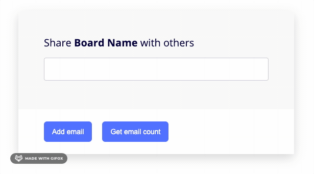

<h1 align="center">Welcome to emails-editor 👋</h1>
<p>
  <a href="#" target="_blank">
    
  </a>
  <a href="https://twitter.com/axelav" target="_blank">
    
  </a>
</p>

> Small vanilla javascript emails-editor library.

The library Allows to collect and delete emails using an input editor.

- An email will be added into the editor when the user:
  - Press `Enter`
  - Press `Comma`
  - Input lose focus
- Supports pasting emails, separated by commas
- Each email entry is validated, if the email is wrong it will be marked as invalid and the corresponding CSS class will be added
- The library does not have external dependencies on production
- The library offers a [Public API]('#public-api') to add an email and get current emails

## Demo



Check out the example [link](https://axelavargas.github.io/emails-editor/examples/vanillaEmailForm/)

## Usage

1. Download the `dist/` folder

2. Include the `script`

```html
<script src="./dist/emailsEditor.bundle.js"></script>
```

3. Include the `styles`: Minimum CSS needed to add styles to each email

```html
<link rel="stylesheet" href="./dist/emailsEditor.css" />
```

Now you will have available in the `window` a global variable called `EmailsInput`

**Add in your project**

```html
<div id="emails-input"></div>

<script>
  const inputContainerNode = document.querySelector('#emails-input');

  const emailsInput = EmailsInput(inputContainerNode);
</script>
```

## Library

The library is compatible with ie11 and the latest browsers versions

#### Parameters

##### inputContainerNode: (Required) HTMLElement

This is an HTML element that will be used to initialize the library

##### onChange: (Optional) callback

Optionally you can pass a callback function that will be triggered when there is a new/update email entry in the EmailsInput library.

#### Public API

##### `getEmails: function () => return array[ {isValid, value, id} ]`

With the instance created, you can access the emails data collected using this function

```html
<script>
  const inputContainerNode = document.querySelector('#emails-input');

  const emailsInput = EmailsInput(inputContainerNode);
  const emailList = emailsInput.getEmails();
  console.log(emailList);
</script>
```

##### `add: function (value: string) => return void`

```html
<script>
  const inputContainerNode = document.querySelector('#emails-input');

  const emailsInput = EmailsInput(inputContainerNode);
  const newEmail = emailsInput.add('test@mail.com');
  const emailList = emailsInput.getEmails();
  console.log(emailList);
</script>
```

## Examples

- Vanilla Email Form: [Source ](./examples/vanillaEmailForm) | [Demo](https://axelavargas.github.io/emails-editor/examples/vanillaEmailForm/)

- Multiple Emails Editor: [Source ](./examples/multipleEmailsEditor) | [Demo](https://axelavargas.github.io/emails-editor/examples/multipleEmailsEditor/)

## Contributing

See [CONTRIBUTING.md](CONTRIBUTING.md)

## Future Improvements

- Publish library as an npm package, to avoid downloading the dist folder
- Extend unit test
- Include e2e tests

## Author

👤 **Alexandra Vargas**

- Twitter: [@axelav](https://twitter.com/axelav)
- Github: [@axelavargas](https://github.com/axelavar)
- LinkedIn: [@axelav](https://linkedin.com/in/axelav)
